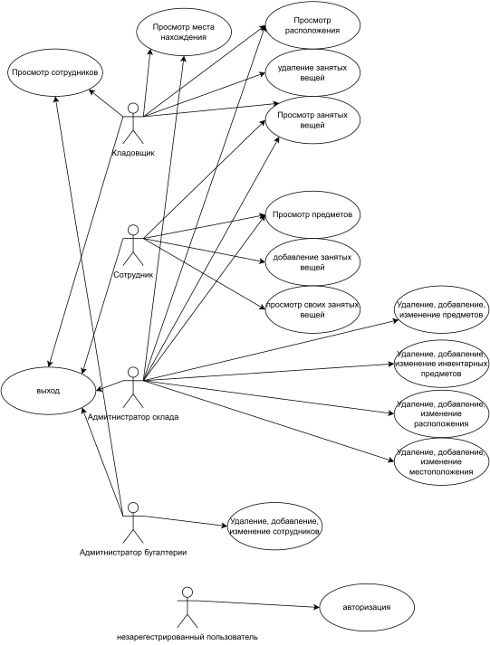
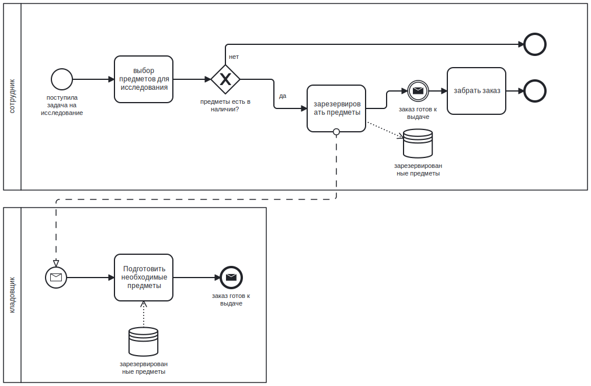

# Лабораторная работа 1

## 1. Название проекта

Система мониторинга и администрирования складов хранения оборудования для малого предприятия.

## 2. Краткое описание идеи проекта

Создать десктопное приложение, которе позволит сотрудникам некого предприятия, бронировать и получать оборудование, необходимое для работы, со склада. Оборудование после использования, возвращается на склад. Суть заключается в том, что бы избежать лишнего хождения сотрудников на склад, для проверки того, отсутствует необходимое оборудование или нет.

## 3. Краткое описание предметной области

Предметной областью является хранение оборудования и манипулирование с им. 

## 4. Краткий анализ аналогичных решений по 3 критериям

## 5. Краткое обоснование целесообразности и актуальности проекта

В 2021 году я был на беломорской биологической станции в качестве волонтера. Моей задачей было проводить ревизию складов с оборудованием. Все записи о том кто и когда берет оборудование велись в тетрадь на складе. То есть чтобы взять, допустим, микроскоп, необходимо было придти на склад в рабочее время, которе не установлено, убедиться что микроскоп есть, записаться в тетрадь, и взять его. Я хочу попробовать оптимизировать данный процесс.

## 6. Use-Case - диаграмма

## 7. ER-диаграмма сущностей

## 8. Пользовательские сценарии

## 9. Формализация бизнес-правил

