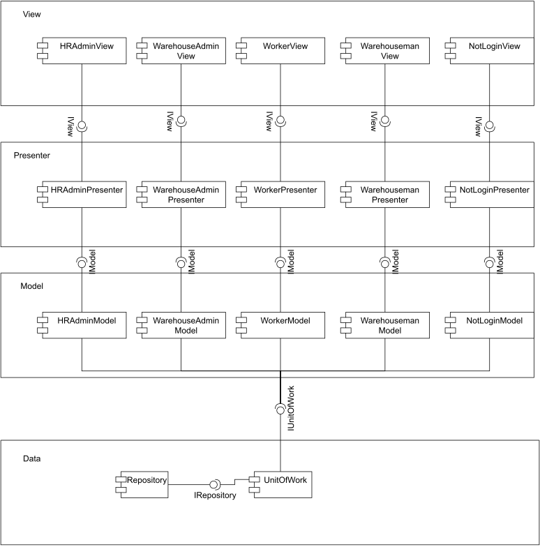

# Лабораторная работа 2

## 1. Тип приложения и стек

Десктопное приложение, на основе windowsForms. Для реализации выбран язык c#. Для хранения данных будет использоваться MSSQL

## 2. Диаграмма компонентов

## 3. UML диаграммы
### 3.2. UML бизнес доступа к данным

### 3.2. UML бизнес логики

